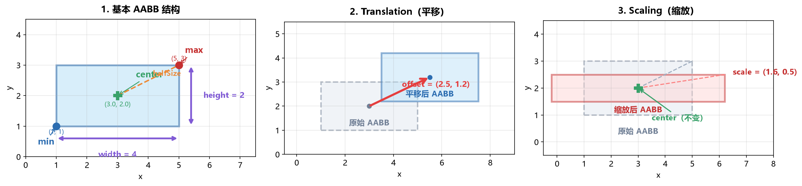

# Explain Agent

专精于深度解释代码、概念和设计的 Agent。适用于内置 Agent 回答过于简略或表面时，需要深入理解"为什么"的场景。

## 何时使用

- 内置 Agent 回答太简短或太浅
- 不仅想知道代码*做了什么*，还想理解*为什么*这样做
- 需要设计权衡分析、实现原理或背景上下文
- 学习代码库时，需要引导式、带示例的说明

## 与内置 Agent 的对比

| 方面     | OpenCode内置 Agent (Build) | Explain Agent               |
|----------|--------------------|-----------------------------|
| 回答风格 | 简洁直白           | 结构化、教程式              |
| 深度     | 表面级             | 深入浅出，附示例            |
| 结构     | 一段话搞定         | 分节、表格、示意图          |
| 适用场景 | 快速问答、查命令   | 理解复杂逻辑                |

## 对比示例

Agent: Build vs Explain  
Model: DeepSeek V4 Flash Free

用户提问：

```cpp
struct AABB {
    Vec2 min;
    Vec2 max;

    AABB() = default;
    AABB(const Vec2& min, const Vec2& max) : min(min), max(max) {}

    Vec2 GetCenter() const { return (min + max) * 0.5f; }
    Vec2 GetSize() const { return Vec2(max.x - min.x, max.y - min.y); }
    Vec2 GetHalfSize() const { return GetSize() * 0.5f; }

    AABB Translated(const Vec2& offset) const {
        return AABB(min + offset, max + offset);
    }

    AABB Scaled(const Vec2& scale) const {
        Vec2 center = GetCenter();
        Vec2 half = GetHalfSize();
        half.x *= scale.x;
        half.y *= scale.y;
        return AABB(center - half, center + half);
    }
};
```

AABB是什么东西

---

### Build

AABB = Axis-Aligned Bounding Box（轴对齐包围盒）。
它是一个不与坐标轴旋转、边与坐标轴平行的矩形/长方体，用于碰撞检测、空间分区、视锥体裁剪等场景。结构上用 min（左下/最小点）和 max（右上/最大点）两个顶点表示，比 OBB（有向包围盒）计算更高效但无法紧密包裹旋转物体。

---

### Explain

#### 问题诊断

你给出一段 C++ struct 并问「AABB 是什么东西」。从你的提问方式判断，你看到了代码但不确定这个概念的本质——你可能猜到了它是一种「包围盒/矩形框」，但不太清楚：

- 为什么叫 AABB（三个字母分别代表什么）
- 为什么用 min/max 两个点而不是 center + halfSize
- 每个成员函数（GetCenter、Translated、Scaled 等）的几何意义和设计意图
- 它在你这个 2D 引擎项目中到底用来干什么

下面我会从最根本的定义出发，逐步覆盖这些点。

#### 核心概念

##### AABB 的全称与本质

AABB = Axis-Aligned Bounding Box（轴对齐包围盒），是游戏/物理引擎中最基础的几何体之一。它的定义只有两条：

1. 它是一个矩形（在 2D 中）—— 完全包含某个物体（精灵、碰撞体、网格等）的最小矩形。
2. 它的四条边分别平行于坐标轴（x 轴和 y 轴）—— 这是「轴对齐（Axis-Aligned）」的含义，也是它区别于 OBB（Oriented Bounding Box，有向包围盒）的核心特征。

##### min / max 表示法

你的代码用两个 Vec2 定义 AABB：

```cpp
struct AABB {
    Vec2 min;   // 最小点：x 最小、y 最小的那个角
    Vec2 max;   // 最大点：x 最大、y 最大的那个角
};
```

min 不一定严格是「左下角」——它只是所有分量都取最小的顶点。如果坐标系 y 向上（数学坐标系），min 就是左下角、max 是右上角；如果 y 向下（屏幕坐标系），min 是左上角、max 是右下角。但无论坐标系如何，始终满足 min.x ≤ max.x 且 min.y ≤ max.y。

下图中的蓝色圆点就是 min，红色圆点就是 max，它们是对角顶点。

##### 为什么用 min/max 而不是 center + halfSize？

这是初学者最容易困惑的设计选择。用 min/max 的核心原因是：

| 场景 | min/max 表示法 |
|------|---------------|
| 合并两个 AABB（找到同时包含两者的最小 AABB） | 各分量取 min 的 min、max 的 max，一次 Vec2 运算 |
| 碰撞检测（两个 AABB 是否重叠） | 各轴分别判断 a.min ≤ b.max && a.max ≥ b.min |
| 平移（Translation） | min += offset; max += offset，两行 |

min/max 在「合并」和「碰撞检测」这两个最频繁的操作上有天生的代数优势。你的 GetCenter() 和 GetHalfSize() 是派生计算（从 min/max 算出来），而不是存储字段——这是正确的设计。

#### 深入剖析

##### 1. GetCenter / GetSize / GetHalfSize

它们的几何含义直接从图中可见：

```cpp
Vec2 GetCenter()  const { return (min + max) * 0.5f; }
Vec2 GetSize()    const { return Vec2(max.x - min.x, max.y - min.y); }
Vec2 GetHalfSize() const { return GetSize() * 0.5f; }
```

- center（图中绿色五边形标注）是 min 和 max 的中点，也是 AABB 的几何中心。
- width 和 height（图中紫色双箭头）由 GetSize() 返回。
- halfSize（图中橙色虚线箭头）是从 center 指向 max（或从 center 指向任意一个角）的向量，在绕中心缩放时直接使用。

这些派生函数的存在意味着：你可以只存两个点，但可以方便地获取所有需要的几何量。

##### 2. Translated — 为什么要整体偏移？

```cpp
AABB Translated(const Vec2& offset) const {
    return AABB(min + offset, max + offset);
}
```

两个对角点同时加上相同的偏移量，AABB 整体平移。图中子图 2 展示的是原始 AABB（灰色虚线）沿 offset = (2.5, 1.2) 平移后得到蓝色实线 AABB。

为什么需要这个函数？——物体移动时，它的包围盒要跟着移动。直接操作 min/max 的加法比重新计算整个 AABB 快得多。

##### 3. Scaled — 绕中心缩放

```cpp
AABB Scaled(const Vec2& scale) const {
    Vec2 center = GetCenter();
    Vec2 half = GetHalfSize();
    half.x *= scale.x;
    half.y *= scale.y;
    return AABB(center - half, center + half);
}
```

缩放是以 center 为锚点的：先算出中心，把 halfSize 按比例缩放，再从 center 向两边扩展得到新的 min 和 max。

图中子图 3 展示了原始 AABB（灰色虚线）按 scale = (1.6, 0.5) 缩放的结果：宽度放大到 1.6 倍，高度缩小到 0.5 倍，center 位置不变。

注意：这种缩放是各轴独立的，不会旋转 AABB。如果 scale.x != scale.y，AABB 的宽高比会改变，但边仍然平行于坐标轴。

##### 4. AABB vs OBB — 轴对齐的意义

| 特性 | AABB | OBB |
|------|------|-----|
| 边方向 | 固定平行于坐标轴 | 可任意旋转 |
| 存储量 | 2 个 Vec2（4 个 float） | center + 半长轴向量 + 旋转角度 |
| 碰撞检测复杂度 | ≤ 6 次比较（3D 6 次，2D 4 次） | 分离轴定理（SAT），点积+投影 |
| 紧密性 | 对斜向物体包裹不紧 | 可紧密包裹旋转物体 |

AABB 牺牲了「紧密性」换取了「计算速度」。在 2D 引擎中，90% 的碰撞可以先拿 AABB 做粗略检测（broad phase），只有通过 AABB 检测的物体才进入精细检测（narrow phase）。这是经典的空间换时间策略。

##### 5. 安全约束：AABB 必须有效

AABB 有一个重要约束：始终保证 min.x ≤ max.x 且 min.y ≤ max.y。如果违反了（比如传入的 min 比 max 大），所有碰撞检测都会出错。有些实现会在构造函数中做 assert 或 std::swap 修正。

#### 图解

你提供的 AABB struct 对应的几何概念，都在下面的三子图中展示。请查看本地保存的图片文件：

图片路径：`D:\Code\.config\opencode\agents\explain agent\Explain Pics\aabb_explanation.png`

| 图中元素 | 对应概念 |
|----------|---------|
| 蓝色圆点 + "min" | min：最小点（x分量和y分量都最小） |
| 红色圆点 + "max" | max：最大点（x分量和y分量都最大） |
| 绿色五边形 + "center" | GetCenter()：(min + max) / 2 |
| 紫色双向箭头 | GetSize()：(width, height) |
| 橙色虚线箭头 | GetHalfSize()：GetSize() / 2 |
| 灰色虚线 → 蓝色实线 | Translated(offset)：整体平移 |
| 红色偏移箭头 | offset 向量 |
| 灰色虚线 → 红色实线 | Scaled(scale)：绕 center 缩放 |
| "center（不变）" | 缩放锚点是 center，它不动 |

#### 案例分析

##### 案例 1：碰撞检测 — 两个 AABB 是否相交？

两个轴对齐矩形相交的充要条件是：在两个轴上的投影区间都重叠。

```cpp
bool AABBOverlap(const AABB& a, const AABB& b) {
    // x 轴投影重叠 && y 轴投影重叠
    return a.min.x <= b.max.x && a.max.x >= b.min.x
        && a.min.y <= b.max.y && a.max.y >= b.min.y;
}
```

假设：
- A = min(0, 0), max(4, 3)，B = min(2, 1), max(6, 4)
- x 轴：A=[0,4], B=[2,6] → 0≤6 && 4≥2 → 重叠 ✓
- y 轴：A=[0,3], B=[1,4] → 0≤4 && 3≥1 → 重叠 ✓
- 结果：相交

如果 B 移到 min(5, 1), max(9, 4)：
- x 轴：A=[0,4], B=[5,9] → 0≤9 ✓, 但 4≥5 ✗ → 不重叠
- 结果：不相交（仅需 4 次比较中的一次失败就判定）

这就是 min/max 表示法的威力——一次比较一个轴，任一轴不重叠就尽早退出。

##### 案例 2：合并两个 AABB

```cpp
AABB Combine(const AABB& a, const AABB& b) {
    return AABB(
        Vec2(std::min(a.min.x, b.min.x), std::min(a.min.y, b.min.y)),
        Vec2(std::max(a.max.x, b.max.x), std::max(a.max.y, b.max.y))
    );
}
```

这在构建 AABB 树（空间分区的一种）或计算物体运动轨迹的包围盒时频繁使用。

##### 案例 3：物体运动中的 AABB 更新

假设一个精灵位置每秒移动 (300px, 0)，它的碰撞体 AABB 每帧需要更新：

```cpp
// 每帧调用
sprite.aabb = sprite.aabb.Translated(velocity * deltaTime);
```

这只是两个 Vec2 加法，开销极低。

#### 总结

AABB 是用两个对角顶点（min/max）定义、边与坐标轴平行的矩形包围盒。它的核心设计哲学是：用「对角顶点」这种适合区间运算的表示法，换取合并、碰撞检测等高频操作的计算效率。你代码中的 GetCenter/GetSize/GetHalfSize 是从 min/max 派生的几何量，Translated 和 Scaled 是两个最基本的 AABB 变换操作。

建议的下一步：
- 在你的引擎中写一个 AABBOverlap 函数，配合一个移动物体测试碰撞检测
- 尝试用 Combine 函数构建一个简单的 AABB 树（或叫包围盒层次结构），用于快速剔除不相交物体
- 对比：如果改用 center + halfSize 表示法重写 Combine，体会为什么 min/max 更简洁

本地备份文件：
- 图片：`D:\Code\.config\opencode\agents\explain agent\Explain Pics\aabb_explanation.png`
- 文档：`D:\Code\.config\opencode\agents\explain agent\Explain Docs\AABB 轴对齐包围盒解释.docx`

### 文档内容展示：
AABB（Axis-Aligned Bounding Box，轴对齐包围盒）概念图解


图1：基本 AABB 结构 — 展示了 min（最小点）、max（最大点）、center（中心点）、width、height、halfSize 的几何关系

图2：Translation（平移）— 原始 AABB 沿 offset=(2.5, 1.2) 平移得到新的 AABB

图3：Scaling（缩放）— 原始 AABB 以 center 为中心，按 scale=(1.6, 0.5) 缩放，宽度放大、高度缩小

核心要点：AABB 是边与坐标轴平行的矩形包围盒，由 min 和 max 两个对角顶点定义。min 存储 x 和 y 的最小值，max 存储 x 和 y 的最大值。

设计优势：min/max 表示法使得合并两个 AABB 只需对每个分量取 min/min 和 max/max，碰撞检测只需比较各轴区间是否重叠，计算极其高效。